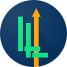

<!--
*** Using the README template from https://github.com/othneildrew/Best-README-Template
-->

<!-- PROJECT LOGO -->
<p align="center">
  <a href="https://github.com/bearbob/LiftingLog">
    
  </a>

  <h3 align="center">Lifting Log</h3>

  <p align="center">
    A convenient way to log lifting progress for power lifters
    <br />
    <a href="https://github.com/bearbob/LiftingLog/tree/master/documentation"><strong>Explore the docs »</strong></a>
    <br />
    <br />
    <a href="https://github.com/bearbob/LiftingLog/issues/new">Report Bug</a>
    ·
    <a href="https://github.com/bearbob/LiftingLog/issues">Request Feature</a>
  </p>
</p>


<!-- TABLE OF CONTENTS -->
## Table of Contents

* [About the Project](#about-the-project)
  * [Built With](#built-with)
* [Getting Started](#getting-started)
  * [Prerequisites](#prerequisites)
  * [Installation](#installation)
* [Roadmap](#roadmap)
* [Contributing](#contributing)
* [License](#license)
<!-- * [Acknowledgements](#acknowledgements) -->


<!-- ABOUT THE PROJECT -->
## About The Project

An android app written in React Native to log lifting progress for power lifters. Log your highest weight and repetitions for a given date and the app will calculate your one rep maximum and strength scores.

There are many other tracking apps available. Therefore, the focus of this app is not to track your whole training, but only the heavy lifts. With this data, it calculates your current 1RM and lifting strength and displays progress graphs for them.

The tracker was developed with these use cases in mind:
* I want to know how much weight I used a given exercise the last time
* I want see how my lifting strength progressed over several training sessions
* I want see my 1RM progress over several weeks


<!-- [![Product Name Screen Shot][product-screenshot]](https://example.com) -->

### Built With

* [React Native](https://reactnative.dev/)
* [JEST](https://jestjs.io/docs/en/tutorial-react-native)
* Android (even though IOS would be possible as well, I have no device to test this)


<!-- GETTING STARTED -->
## Getting Started

To get a local copy up and running follow these simple steps.

### Prerequisites

This is  a list of things you need to use the software and how to install them.
* npm
```sh
npm install npm@latest -g
```
* React Native - Follow the instructions for the [React Native CLI Quickstart](https://reactnative.dev/docs/environment-setup)


### Installation

```sh
1. Clone the repo
git clone https://github.com/bearbob/LiftingLog.git
```
2. Install NPM packages
```sh
npm install
```

### Running
* Execute `npm start` to setup and run the app on your environment
* Execute `npm test`, if your want to run the unit tests


<!-- ROADMAP -->
## Roadmap

See the [open issues](https://github.com/bearbob/LiftingLog/issues) for a list of proposed features (and known issues).


<!-- CONTRIBUTING -->
## Contributing

Contributions are what make the open source community such an amazing place to be learn, inspire, and create. Any contributions you make are **greatly appreciated**.

1. Read the [rules for contribution](./CONTRIBUTING.md)
1. Fork the Project
2. Create your Feature Branch (`git checkout -b feature/AmazingFeature`)
3. Commit your Changes (`git commit -m 'Add some AmazingFeature'`)
4. Push to the Branch (`git push origin feature/AmazingFeature`)
5. Open a Pull Request (a good title and description speed up the review process)


<!-- LICENSE -->
## License

Distributed under the Apache License 2.0. See `LICENSE` for more information.


<!-- ACKNOWLEDGEMENTS -->
<!-- ## Acknowledgements

* []()
* []()

-->


<!-- MARKDOWN LINKS & IMAGES -->
<!-- https://www.markdownguide.org/basic-syntax/#reference-style-links -->
[contributors-shield]: https://img.shields.io/github/contributors/bearbob/repo.svg?style=flat-square
[contributors-url]: https://github.com/bearbob/repo/graphs/contributors
[forks-shield]: https://img.shields.io/github/forks/bearbob/repo.svg?style=flat-square
[forks-url]: https://github.com/bearbob/repo/network/members
[stars-shield]: https://img.shields.io/github/stars/bearbob/repo.svg?style=flat-square
[stars-url]: https://github.com/bearbob/repo/stargazers
[issues-shield]: https://img.shields.io/github/issues/bearbob/repo.svg?style=flat-square
[issues-url]: https://github.com/bearbob/repo/issues
[license-shield]: https://img.shields.io/github/license/bearbob/repo.svg?style=flat-square
[license-url]: https://github.com/bearbob/repo/blob/master/LICENSE.txt
[linkedin-shield]: https://img.shields.io/badge/-LinkedIn-black.svg?style=flat-square&logo=linkedin&colorB=555
[linkedin-url]: https://linkedin.com/in/bearbob
[product-screenshot]: images/screenshot.png
